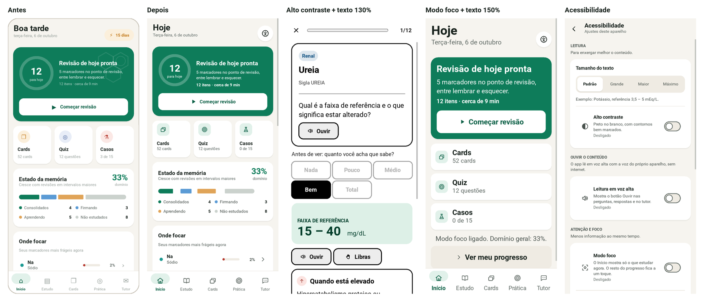

# Evolução do BioquímicaEDU — análise e decisões

Outubro de 2026. Análise do app como produto, feita pelos olhos de seis
especialistas (UI/UX, segurança, acessibilidade, IA, desenvolvimento e
marca), seguida do que foi implementado e do que depende de decisão.

Projeto: *Desenvolvimento de software educacional para o ensino interativo de
bioquímica clínica: marcadores bioquímicos e sua correlação com doenças*
(PIBIC/CNPq — UNICID).

---

## 1. Ponto de partida

| Parte | Situação encontrada |
|---|---|
| Versão mobile (Kivy) | Produto principal: 5 abas, revisão espaçada, cards, quiz, casos, tutor offline. Roda no Android e no computador. |
| Versões desktop (Tkinter) | `main.py` e `main_enhanced.py` (com tutor via Ollama). Funcionais, mas duplicam telas da versão mobile. |
| Núcleo | `progresso.py` (motor SM-2 adaptado) e `data/` (conteúdo curado), compartilhados. |
| Contas, servidor, internet | Nenhum. Todo dado do estudante fica no aparelho. |
| IA | Só no computador, opcional: Ollama com o modelo **Mistral** por padrão (não Llama, embora o Ollama também rode Llama). No celular, o tutor responde pela base do app. |

O ponto de partida é bom: offline, sem coleta de dados, conteúdo com fonte.
A análise não começou do zero; mexeu no que impedia o app de parecer — e
funcionar como — um produto.

---

## 2. Análise por especialista

### 2.1 UI/UX

**Problemas encontrados**
1. **Ícones de fonte** (⌂ ▤ ❐ ◎ ✉): cada um com peso e altura diferentes, e
   o do tutor era um envelope. É o sinal mais forte de "protótipo".
2. **Decoração sem função**: moléculas no cartão principal, selo com raio
   (⚡) para a sequência de dias, saudação "Boa tarde". Padrões comuns em
   interfaces geradas automaticamente.
3. **Contraste insuficiente** (medido com a fórmula da WCAG 2.2): o cinza de
   legendas e subtítulos tinha **2,4:1** (mínimo: 4,5:1); o botão "Difícil",
   3,5:1; as cores de sistema usadas como texto, entre 2,9 e 4,4:1.
4. **Alvos de toque pequenos**: chips de 36 dp e botões de ícone de 44 dp.
5. **Texto grande quebrava o layout**: caixas de altura fixa cortavam o texto
   — no Android, quem já usa fonte grande no sistema via isso.
6. **Deslocamento ao navegar**: ao sair da revisão ou da apresentação, o
   Início nascia com a altura errada e a rolagem saltava até 300 px.
7. **Casos resolvidos sumiam** ao fechar o app ("3 de 15" voltava a "0").
8. **Sem estados de carregamento e erro**: o tutor mostrava "Consultando…"
   como um balão comum; falha de dados abria o app vazio.
9. **Sem primeiro acesso**: o estudante caía direto num painel cheio.

**Feito**
- Conjunto próprio de **ícones vetoriais** (`mobile/icones.py`): grade de
  24 × 24, traço único, cantos arredondados — a gramática dos conjuntos de
  ícones de produto.
- Início com título "Hoje", acesso à Acessibilidade no topo; sequência de
  dias movida para o cartão de Constância, sem pressão visual.
- **Paleta corrigida**: todo texto com contraste ≥ 4,5:1; cada sistema com
  um tom de ponto e outro de texto.
- Alvos de toque de 44–48 dp; linhas de ajuste tocáveis por inteiro.
- **Caixas que crescem com o texto** (`dpt()`), e layouts que mudam de forma
  com letra grande (botões em 2 linhas, lista sem colunas espremidas).
- Correção da navegação (a barra aparece antes de a tela ser montada).
- Componentes de estado: `Aviso` (info/sucesso/atenção/erro, sempre com
  ícone + texto), `Digitando` (tutor), mensagens temporárias, erro na abertura
  com "Tentar de novo".
- **Tela de abertura** e **apresentação de primeiro acesso** (seções 3 e 4).
- Casos resolvidos salvos no progresso.

**Fica para depois (com motivo)**
- *Tipografia*: o Kivy traz só a Roboto em regular e negrito. Uma fonte de
  produto (sugestão: **Atkinson Hyperlegible Next**, criada para baixa visão,
  licença OFL) exige baixar o arquivo — pedido de autorização na seção 8.
- *Modo escuro*: precisa de uma camada de cores "semânticas" (ex.: "texto
  sobre ação") em vez de nomes como "branco". Viável, mas é uma revisão de
  todas as telas; não entrou agora.
- *Tablet e paisagem*: o app é só retrato.

### 2.2 Segurança

O app atual tem pouca superfície de ataque **porque não tem servidor, conta
nem rede**. A análise priorizou o que existe, sem criar complexidade para
riscos que o app não corre.

| Achado | Risco | Feito |
|---|---|---|
| Arquivo de preferências lido sem validação | Valor inesperado derruba o app | Lista branca de campos e valores; gravação atômica |
| Progresso com campo corrompido | Perda do progresso inteiro | Validação por campo e por marcador: só o que está errado volta ao padrão |
| Links abertos sem checagem | Dado alterado poderia abrir outro esquema | Só `https://` |
| Texto de dados em rótulos com *markup* | Injeção de formatação | Escape (`escape_markup`) |
| Respostas de erro do Ollama ("❌ Erro…") exibidas como resposta | Informação enganosa | Detectadas e trocadas pela base, com aviso |
| Prompt do Ollama sem os dados do app | Modelo inventa valores de referência | Prompt **ancorado** no conteúdo curado + temperatura baixa (`assistente.py`) |
| Testes moviam o progresso real do estudante | **Perda de dados** (aconteceu nesta sessão e foi restaurada) | Testes usam pasta temporária (`BIOQ_PASTA_ALUNO`) |
| Repositório público | Vazamento de chave no futuro | Varredura: nenhuma credencial; `.gitignore` para `.env` e credenciais |
| Android | — | Nenhuma permissão; manifesto declara só a consulta ao serviço de voz e ao VLibras (não é permissão) |

Recomendações para quando houver login ou nuvem estão na seção 5.

### 2.3 Acessibilidade

**Limitação estrutural, dita com clareza**: o Kivy desenha a interface por
conta própria e **não a expõe a leitores de tela** (TalkBack, NVDA). Não há
suporte no Kivy nem no python-for-android
([discussão no grupo kivy-users](https://groups.google.com/g/kivy-users/c/F8JODhKGprM)).
Por isso o app **lê ele mesmo** o conteúdo em voz alta. Suporte real a
leitor de tela exigiria outra tecnologia de interface (seção 6).

| Perfil | Implementado | Não implementado (e por quê) |
|---|---|---|
| Surdez | Nenhuma informação só em áudio: todo retorno é visual (ícone + texto + cor). **Atalho para o VLibras**: copia o texto e abre o app VLibras (Governo Federal), que traduz para Libras com avatar. | Integração direta: o VLibras não oferece API para apps nativos ([guia do app](https://vlibras.gov.br/files/Dev_VLibras_CrossPlatform_App.pdf)); o widget é só para sites. Termos técnicos tendem a ser soletrados (datilologia). |
| Baixa visão | Texto em 4 tamanhos (até 150%, somado à escala do sistema); **alto contraste**; contraste AA no tema padrão; **leitura em voz alta**; alvos maiores. | Leitor de tela (limitação do Kivy). |
| Dificuldade de leitura | Leitura em voz alta com **3 velocidades**; texto em blocos curtos; nada justificado. | Versão em linguagem simplificada das interpretações: é conteúdo novo e precisa de revisão por docente da saúde. |
| TDAH / concentração | **Modo foco** (o Início mostra só o que estudar agora); **sessões curtas** (5, 12 ou 20 itens); uma pergunta por vez com barra de progresso; **reduzir animações**. | Lembretes: exigem permissão de notificação e agendamento no Android; sem pedido dos usuários, viraria só mais um alerta. |
| Dificuldade motora | Alvos de 44–48 dp; nenhum gesto obrigatório; nada com tempo limite. | Navegação por teclado/acionador (o Kivy tem suporte limitado). |
| Quem prefere simplicidade | Apresentação curta, uma ação principal por tela, modo foco. | — |

Os ajustes ficam em **Início › Acessibilidade** e são oferecidos já na
apresentação de primeiro acesso.

### 2.4 IA — Llama (local) × Gemini (nuvem)

Fontes conferidas em 06/10/2026:
[preços](https://ai.google.dev/gemini-api/docs/pricing),
[termos](https://ai.google.dev/gemini-api/terms),
[modelo 3.5 Flash-Lite](https://ai.google.dev/gemini-api/docs/models/gemini-3.5-flash-lite),
[regiões](https://ai.google.dev/gemini-api/docs/available-regions).

| Critério | Modelo local (Llama/Mistral via Ollama) | Gemini (API) |
|---|---|---|
| Onde roda | Só no computador do estudante; **não roda no celular** com Kivy | Qualquer aparelho com internet |
| Qualidade em PT-BR e saúde | Modelos de 7–8 bilhões de parâmetros, que cabem num notebook, erram mais | Superior |
| Velocidade | Depende do hardware; sem placa de vídeo, dezenas de segundos | Segundos |
| Custo | Zero em dinheiro; ~4–5 GB de download e 8 GB de RAM | Camada gratuita com limites; pago: Flash-Lite 3.5 a **US$ 0,30 / 1 M tokens de entrada e US$ 2,50 / 1 M de saída** — estimativa de ~**US$ 1,20 por mil perguntas** (1.500 tokens de entrada + 300 de saída cada) |
| Limites | Nenhum | Gratuito: limites por minuto/dia vistos no AI Studio; sujeito a mudanças |
| Janela de contexto | Limitada pela memória | 1.048.576 tokens de entrada (Flash-Lite 3.5) — irrelevante aqui: o app usa poucos milhares |
| Seguir instruções / saída estruturada | Razoável | Bom; saída estruturada e chamada de funções |
| Multimodal | Texto (nesta configuração) | Texto, imagem, áudio, vídeo, PDF |
| Privacidade | **Nada sai do aparelho** | **Camada gratuita: o Google usa o conteúdo para melhorar produtos e pode haver revisão humana.** Camada paga: não usa. Termos exigem 18+ de quem usa a API. |
| Manutenção | Instalação no computador de cada estudante | Servidor intermediário, chave, cotas e troca de modelos (a página lista modelos já desligados) |

**Recomendação**: o tutor não deve ser a fonte da verdade em saúde — o
conteúdo curado é. O papel da IA é **explicar** esse conteúdo. Assim:

1. a **base curada continua sendo a resposta padrão** e a reserva quando a IA falha (já é assim);
2. **para o celular**, o Gemini (classe Flash-Lite) é a única forma realista de
   ter IA generativa, e a melhor opção técnica — **desde que** (a) a chave fique
   num servidor intermediário, nunca no app; (b) se use a camada **paga** fora de
   testes, ou ao menos nenhum dado pessoal seja enviado e o estudante seja
   avisado; (c) o prompt continue ancorado no conteúdo curado;
3. **o Ollama não deve ser substituído, e sim mantido** como opção local para
   quem prefere privacidade total no computador.

Ou seja: **acrescentar** o Gemini, não trocar. A arquitetura já está pronta
para isso: `assistente.py` tem provedores trocáveis com reserva automática
(`BaseLocal`, `ModeloLocal`); um `ModeloNuvem` entra como mais uma classe.
**Não implementei a chamada ao Gemini** porque ela depende de decisões e
contas suas (seção 8): sem servidor e chave, o código não teria como ser
testado nem usado com segurança.

### 2.5 Desenvolvimento

- **Três interfaces** para o mesmo conteúdo (Tkinter ×2 e Kivy) multiplicam a
  manutenção. A versão Kivy roda também no computador; recomendo tratá-la
  como o produto e congelar as versões Tkinter (sem removê-las agora).
- Núcleo compartilhado bem separado (`progresso.py`, `assistente.py`, `data/`).
- Testes: `test_kivy_completo.py` passou de 8 para **15 passos** (acessibilidade,
  voz, Libras, foco, persistência, preferências corrompidas, reserva do
  tutor); `test_desktop.py` cobre as duas versões Tkinter.
- Ponto em aberto do motor: após o 1º contato, "Difícil", "Bom" e "Fácil"
  mostram o mesmo próximo intervalo (decisão pendente desde o relatório).

### 2.6 Marca

A identidade já tinha um conceito (hexágono = química; gota = amostra de
sangue). Faltavam as versões que um produto usa. Ver
[`IDENTIDADE_VISUAL.md`](IDENTIDADE_VISUAL.md).

---

## 3. Tela de abertura

1. O Android mostra a imagem de abertura (`presplash`) enquanto o Python
   inicia: mesma logo, mesmo fundo — a troca não pisca.
2. A tela de abertura do app aplica as preferências (tamanho, contraste,
   animações), carrega conteúdo, progresso e voz.
3. Primeiro acesso → apresentação; demais → Início.
4. A logo aparece e assenta em 0,35 s (sem animação se o estudante pediu);
   o tempo mínimo na tela é 0,7 s — não atrasa quem já carregou.
5. Se o conteúdo não puder ser lido, a própria abertura explica e oferece
   "Tentar de novo".

*Verificação de autenticação*: não há login hoje. Se houver (seção 5), ela
entra no passo 2, sem bloquear o uso offline.

## 4. Primeiro acesso

Três passos, com "Pular": o que é o app; como ele ajuda a lembrar (o ciclo
da revisão); ajustes de leitura e foco. Os ajustes de acessibilidade vêm no
começo porque quem precisa de letra maior não deveria atravessar o app até
encontrá-los.

## 5. Login com Google — análise antes de implementar

**Não implementei**, e a razão é de produto e de segurança: hoje o app não
tem dado pessoal para proteger. Um login traz:

- dados pessoais (nome, e-mail) → obrigações da LGPD (base legal, aviso de
  privacidade, direitos do titular);
- tokens a guardar e renovar, um servidor, dependência de internet;
- risco de falha na apresentação (rede da sala).

**Login faz sentido se servir a um destes objetivos**:
(a) sincronizar o progresso entre celular e computador;
(b) proteger o tutor de IA na nuvem contra uso abusivo da chave;
(c) coletar dados agregados para pesquisa, com consentimento.

**Arquitetura recomendada, se aprovada**

- **Login opcional**: "Continuar sem conta" segue como padrão; nada do que
  funciona hoje passa a depender de rede.
- **Firebase Authentication** (provedor Google) + **Cloud Firestore** — ambos no
  plano gratuito ([preços](https://firebase.google.com/pricing): 1 GiB, 50 mil
  leituras e 20 mil gravações por dia). Funções de servidor (Cloud Functions)
  exigem o plano pago **Blaze**.
- **Android**: "Sign in with Google" pelo **Credential Manager**, a API atual — a
  antiga (GoogleSignInClient) está descontinuada
  ([documentação](https://developer.android.com/identity/sign-in/credential-manager-siwg)).
  O Kivy não tem integração pronta: exige código Java anexado ao APK via
  pyjnius — trabalho considerável e só testável num aparelho, com o projeto
  do Google Cloud criado por você.
- **Computador**: OAuth 2.0 para apps instalados, com PKCE e retorno local
  (RFC 8252); token guardado no cofre do sistema operacional.
- **Sessão**: token de identidade do Firebase dura 1 hora e é renovado pelo
  token de atualização; logout apaga os tokens locais; no celular, tokens
  em armazenamento protegido pelo Android Keystore e **fora do backup**
  (`android.backup_rules`).
- **Regras do banco**: cada estudante lê e grava só o próprio documento:

```
rules_version = '2';
service cloud.firestore {
  match /databases/{db}/documents {
    match /alunos/{uid} {
      allow read, write: if request.auth != null && request.auth.uid == uid;
    }
    match /{caminho=**} { allow read, write: if false; }
  }
}
```

- **Servidor intermediário da IA** (se houver Gemini): valida o token de
  identidade, limita perguntas por estudante, guarda a chave em segredo do
  provedor de nuvem e lê o nome do modelo de configuração.
- **Chaves**: nada no código. Configurações do Firebase para Android não são
  segredo, mas a chave do Gemini é: só no servidor.

## 6. Questão estrutural: Kivy ou web?

Vários pedidos — leitor de tela, VLibras integrado (o widget é para sites),
login com Google, site — seriam mais simples numa **aplicação web instalável
(PWA)**. Seria reescrever a interface. **Não recomendo antes do fim do PIBIC**:
o app atual funciona, foi o avaliado e cobre o essencial. Fica como proposta
para uma próxima fase, com o núcleo (`progresso.py`, `assistente.py`, `data/`)
reaproveitável.

## 7. Verificação

- `python test_kivy_completo.py` — 15 passos, todos passando.
- `python test_desktop.py` — todas as telas das duas versões desktop abrem.
- Telas renderizadas e inspecionadas em três configurações: padrão; alto
  contraste com texto a 130%, voz e Libras; modo foco com texto a 150% e
  animações desligadas.
- Ícone adaptativo conferido com máscaras de círculo e *squircle*.
- **Não verificado**: leitura em voz no Android, atalho para o VLibras no
  Android e o APK com o ícone adaptativo — exigem compilar e instalar num
  aparelho.

## 8. Decisões que dependem de você

1. **Login com Google**: qual objetivo (a, b ou c da seção 5)? Sem objetivo,
   recomendo não fazer agora. Se sim, é preciso criar o projeto no Firebase
   com a sua conta Google.
2. **Gemini**: você cria a chave no Google AI Studio e aceita a camada paga
   (~US$ 1,20 por mil perguntas)? Onde hospedar o servidor intermediário?
3. **Fonte**: autoriza baixar a Atkinson Hyperlegible Next (Google Fonts, OFL)?
4. **Revisão**: "Difícil/Bom/Fácil" devem mostrar intervalos diferentes já no
   próximo agendamento?
5. **Relatório**: as novidades de acessibilidade entram no relatório final?
   A avaliação com usuários foi feita com a versão anterior; se entrarem,
   precisam aparecer como evolução posterior à avaliação.


