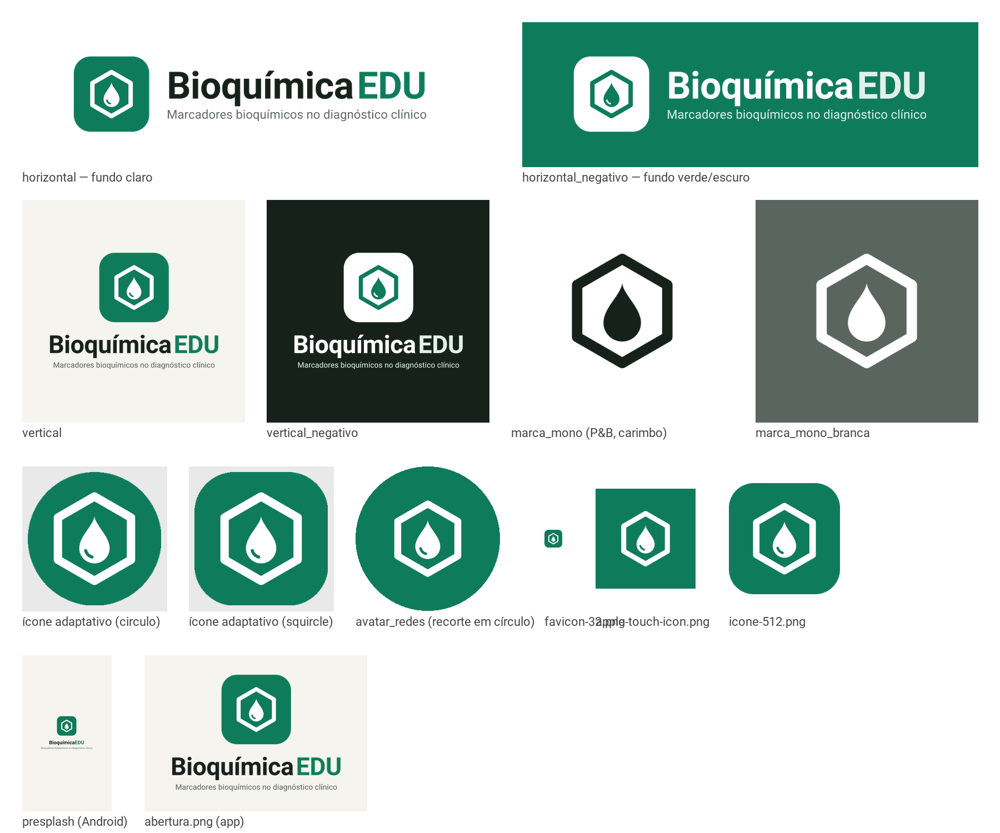

# Identidade visual do BioquímicaEDU

Todos os arquivos saem de `python criar_logo.py`, a partir de uma única
geometria: SVG e PNG são sempre o mesmo desenho.

## Conceito

O app ensina a ler **marcadores bioquímicos** — substâncias medidas numa
amostra de sangue — e a **correlacioná-los com doenças**. O símbolo junta
as duas metades dessa ideia:

- **Hexágono** — o anel benzênico, a forma mais reconhecível da química
  orgânica: o lado *bioquímico*.
- **Gota** — a amostra de sangue de onde vêm os marcadores: o lado *clínico*.
  O pequeno reflexo na base é o que a faz ler como líquido.

A gota está **dentro** do hexágono: o dado clínico interpretado pela
bioquímica. O desenho é geométrico e de traço único para funcionar de
48 px (ícone) a banner.

## Cores

| Nome | Hex | Uso |
|---|---|---|
| Verde laboratório | `#0E7C5A` | Cor da marca e da ação principal. Branco sobre ele: 5,2:1 |
| Verde escuro | `#0A5F45` | Texto em verde sobre fundo claro (6,6:1 sobre a menta) |
| Menta | `#E1F1EA` | Fundos suaves; "EDU" na versão negativa |
| Tinta | `#17211C` | Texto principal (15,9:1 sobre o papel) |
| Cinza de apoio | `#4A534E` | Texto secundário (7,2:1) |
| Papel | `#F6F4EF` | Fundo do app e das aberturas |

Âmbar `#9A5A0A`, rubro `#B5392F` e índigo `#3F5C9A` têm significado fixo no
app (atenção, fragilidade, metacognição) e **não** fazem parte da marca.

## Tipografia

- **Marca e interface**: Roboto Bold (nome) e Regular (subtítulo), a fonte que
  vem com o Kivy — garante que logo e app falem a mesma língua visual.
- No SVG o texto está **convertido em contornos**: não depende de fonte
  instalada na gráfica.
- Evolução sugerida: **Atkinson Hyperlegible Next** (Braille Institute, licença
  OFL), desenhada para leitores com baixa visão — reforçaria a proposta de
  acessibilidade. Depende de autorização para baixar o arquivo.

## Versões

| Arquivo (`assets/logo/`) | Quando usar |
|---|---|
| `horizontal.svg/png` | Documentos, cabeçalhos, slides em fundo claro |
| `horizontal_negativo.svg/png` | Fundo verde ou escuro |
| `vertical.svg/png` | Capa, centro de banner, abertura |
| `vertical_negativo.svg/png` | Banner ou slide escuro |
| `simbolo.svg/png` | Sozinho, quando o nome já aparece por perto |
| `marca_mono.svg/png` | Impressão em preto e branco, carimbo, gravação |
| `marca_mono_branca.svg/png` | Sobre foto ou fundo escuro, em uma cor |
| `avatar_redes.png` (1080²) | Foto de perfil — resiste ao recorte em círculo |
| `favicon-32.png`, `apple-touch-icon.png`, `icone-512.png` | Site |
| `abertura.png` | Tela de abertura do app (versão leve) |

No app (`assets/`): `icon.png` (ícone clássico), `icone_frente.png` +
`icone_fundo.png` (ícone adaptativo do Android 8+, desenho em ~70% da área
visível) e `presplash.png` (abertura do Android).

## Regras de uso

- **Área livre**: em volta da logo, no mínimo a altura do "E" de EDU.
- **Tamanho mínimo**: símbolo com 24 px; logo horizontal com 120 px de largura
  (abaixo disso, use só o símbolo).
- **Não**: esticar, girar, trocar as cores, aplicar sombra ou degradê, colocar
  a versão verde sobre fundo verde, separar a gota do hexágono.

## Prompt para explorar alternativas num gerador de imagens

Se quiser comparar com outras direções antes de fechar a marca:

> Logotipo minimalista e plano para um aplicativo educacional de bioquímica
> clínica chamado "BioquímicaEDU". Símbolo: um hexágono de traço espesso e
> cantos arredondados (anel benzênico) contendo uma única gota de sangue
> estilizada, vista de frente, com um pequeno reflexo curvo na base. Estilo
> geométrico, traço uniforme, sem gradientes, sem sombras, sem brilho 3D, sem
> texturas. Cores: verde #0E7C5A e branco, com opção em uma cor. Composição
> centralizada, símbolo em placa quadrada de cantos arredondados, legível em
> 48 px. Ao lado, o nome "Bioquímica" em sans-serif negrito grafite #17211C e
> "EDU" em verde #0E7C5A. Fundo branco liso. Não incluir: moléculas
> realistas, tubos de ensaio, microscópios, DNA, cruzes médicas, corações,
> letras estilizadas dentro do símbolo, mascotes.

Resultado de gerador de imagem é rascunho: a versão final deve ser
redesenhada em vetor (como em `criar_logo.py`) para manter traço e
proporções exatos.

